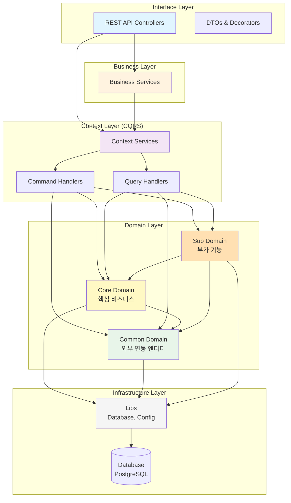

"clientId": "cef8c785-d013-4f47-8780-84b3dac494f9",
"clientSecret": "72970ccc55d3fd612ed78c667d1c94882281f64a4ae4be7cc0ac85149f90208b",

# 루미르 평가 관리 시스템 (Lumir Evaluation Management System)

> NestJS 기반의 엔터프라이즈급 인사평가 관리 시스템

## 📋 프로젝트 소개

루미르 평가 관리 시스템은 조직의 성과 평가 프로세스를 체계적으로 관리하는 시스템입니다. Domain-Driven Design과 CQRS 패턴을 적용하여 확장 가능하고 유지보수가 용이한 구조로 설계되었습니다.

### 주요 기능

- 평가 기간 및 평가 대상 관리
- 프로젝트/WBS 기반 평가 기준 설정
- 자기평가, 동료평가, 하향평가, 최종평가 지원
- 평가자 라인 및 평가 권한 관리
- 대시보드 및 평가 현황 조회

## 🏗️ 아키텍처

### 레이어드 아키텍처



### 의존성 규칙

```
Interface → Business → Context → Domain → Infrastructure
    ↓          ↓          ↓          ↓
   DTO      조합 로직   CQRS      엔티티      Database
```

**도메인 간 의존성:**

- ✅ Core Domain → Common Domain
- ✅ Sub Domain → Core Domain, Common Domain
- ❌ Common Domain → Core/Sub Domain

## 📁 폴더 구조

```
lumir-evaluation-management-system/
├── libs/                           # 공통 라이브러리
│   ├── config/                    # Swagger 설정
│   └── database/                  # Database 설정, 트랜잭션 관리
│
├── src/
│   ├── domain/                    # 도메인 엔티티 (DDD)
│   │   ├── common/               # 외부 시스템 연동 엔티티
│   │   │   ├── department/       # 부서
│   │   │   ├── employee/         # 직원
│   │   │   ├── project/          # 프로젝트
│   │   │   └── wbs-item/         # WBS 항목
│   │   ├── core/                 # 핵심 비즈니스 엔티티
│   │   │   ├── evaluation-period/                # 평가 기간
│   │   │   ├── evaluation-period-employee-mapping/ # 평가 대상
│   │   │   ├── evaluation-project-assignment/     # 프로젝트 배정
│   │   │   ├── evaluation-wbs-assignment/         # WBS 배정
│   │   │   ├── wbs-evaluation-criteria/           # WBS 평가 기준
│   │   │   ├── evaluation-line/                   # 평가자 라인
│   │   │   ├── wbs-self-evaluation/               # 자기평가
│   │   │   ├── peer-evaluation/                   # 동료평가
│   │   │   ├── downward-evaluation/               # 하향평가
│   │   │   └── final-evaluation/                  # 최종평가
│   │   └── sub/                  # 부가 기능 엔티티
│   │       ├── evaluation-question/   # 평가 질문
│   │       ├── evaluation-response/   # 평가 응답
│   │       ├── question-group/        # 질문 그룹
│   │       └── question-group-mapping/
│   │
│   ├── context/                   # CQRS 패턴 비즈니스 로직
│   │   ├── dashboard-context/                      # 대시보드
│   │   ├── organization-management-context/        # 조직 관리
│   │   ├── evaluation-period-management-context/   # 평가 기간 관리
│   │   ├── evaluation-criteria-management-context/ # 평가 기준 관리
│   │   ├── evaluation-question-management-context/ # 평가 질문 관리
│   │   ├── performance-evaluation-context/         # 성과 평가
│   │   └── test-context/                          # 테스트 환경
│   │
│   ├── business/                  # 복잡한 비즈니스 로직 조합
│   │   ├── peer-evaluation/      # 동료평가 비즈니스 로직
│   │   └── wbs-assignment/       # WBS 배정 비즈니스 로직
│   │
│   ├── interface/                 # REST API 컨트롤러
│   │   └── admin/                # 관리자 API
│   │       ├── dashboard/               # 대시보드
│   │       ├── employee-management/     # 직원 관리
│   │       ├── evaluation-period/       # 평가 기간 관리
│   │       ├── evaluation-criteria/     # 평가 기준 관리
│   │       └── performance-evaluation/  # 성과 평가
│   │
│   └── main.ts                    # 애플리케이션 진입점
│
├── test/                          # E2E 테스트
│   └── interface/admin/          # API 테스트
│
└── docs/                          # 문서
    ├── domain-classification-guide.md     # 도메인 분류 가이드
    ├── database-tables-specification.md   # DB 테이블 명세
    └── evaluation-system-erd.md          # ERD 문서
```

## 🛠️ 주요 기술 스택

- **Framework**: NestJS 11.x
- **Language**: TypeScript 5.x
- **Database**: PostgreSQL (TypeORM 0.3.x)
- **Architecture Pattern**: CQRS, DDD, Clean Architecture
- **Testing**: Jest, Supertest (E2E)
- **API Documentation**: Swagger (OpenAPI 3.0)
- **Container**: Docker, Testcontainers

## 🎯 주요 아키텍처 패턴

### 1. Domain-Driven Design (DDD)

도메인을 Common, Core, Sub로 분류하여 관리합니다.

- **Common Domain**: 외부 시스템 연동 (부서, 직원, 프로젝트 등)
- **Core Domain**: 핵심 평가 비즈니스 로직
- **Sub Domain**: 부가 기능 (평가 질문, 응답 등)

### 2. CQRS (Command Query Responsibility Segregation)

읽기(Query)와 쓰기(Command)를 분리하여 관리합니다.

- **Command Handler**: 데이터 생성/수정/삭제
- **Query Handler**: 데이터 조회 (복잡한 조인 쿼리 최적화)

### 3. 레이어드 아키텍처

각 레이어는 명확한 책임을 가지며 단방향 의존성을 유지합니다.

- **Interface**: API 엔드포인트, DTO 변환
- **Business**: 복잡한 비즈니스 로직 조합
- **Context**: CQRS 패턴 적용
- **Domain**: 엔티티 및 도메인 로직
- **Infrastructure**: 데이터베이스, 외부 연동

## 🚀 프로젝트 설정 및 실행

### 설치

```bash
npm install
```

### 실행

```bash
# 개발 모드
npm run start:dev

# 프로덕션 모드
npm run start:prod
```

### 테스트

```bash
# 단위 테스트
npm run test

# E2E 테스트
npm run test:e2e

# E2E 테스트 (빠른 실행)
npm run test:e2e:fast

# 테스트 커버리지
npm run test:cov
```

### API 문서

애플리케이션 실행 후 Swagger 문서를 확인할 수 있습니다:

```
http://localhost:3000/api
```

## 📚 참고 문서

### 개발 가이드

- [Context 레이어 개발 가이드](src/context/AGENTS.md) - CQRS 패턴, QueryBuilder 베스트 프랙티스
- [Interface 레이어 개발 가이드](src/interface/AGENTS.md) - API 컨트롤러, DTO 작성 규칙
- [Interface README](src/interface/README.md) - 컨트롤러 작성 패턴, Swagger 문서화

### 아키텍처 문서

- [도메인 분류 가이드](docs/domain-classification-guide.md) - DDD 도메인 구조 및 의존성 규칙
- [데이터베이스 에러 처리](libs/database/README-error-handling.md) - 트랜잭션 관리, 에러 처리

### 데이터베이스 문서

- [데이터베이스 테이블 명세](docs/database-tables-specification.md)
- [평가 시스템 ERD](docs/evaluation-system-erd.md)

## 🔑 핵심 컨벤션

### 1. Context 서비스 메서드명

한글로 작성하며 '~한다' 형태로 끝냅니다.

```typescript
async 평가기간을_생성한다(data: CreateEvaluationPeriodDto)
async 평가대상을_조회한다(periodId: string)
```

### 2. TypeORM QueryBuilder

모든 쿼리에 Soft Delete 조건을 포함합니다.

```typescript
.where('entity.id = :id', { id })
.andWhere('entity.deletedAt IS NULL')
```

### 3. API 컨트롤러

단순성을 유지하며, DTO 변환만 수행합니다.

```typescript
async createEvaluation(@Body() dto: CreateDto) {
  return await this.service.평가를_생성한다(dto);
}
```

## 📝 라이선스

UNLICENSED - 사유 프로젝트

## 👥 개발팀

루미르 개발팀
