# 평가 관리 시스템 ERD

## 개요

이 문서는 루미르 평가 관리 시스템의 데이터베이스 구조를 Mermaid ERD로 표현합니다.

## ERD 다이어그램

```mermaid
erDiagram
    %% 평가 기간 관리
    EVALUATION_PERIOD {
        string id PK
        string name
        string startDate
        string endDate
        string description
        string status "inactive|criteria-setting|active|performance-input|final-evaluation|completed"
        string createdAt
        string criteriaStartDate
        string criteriaEndDate
        string performanceStartDate
        string performanceEndDate
        string finalEvaluationStartDate
        string finalEvaluationEndDate
        string completedDate
        boolean criteriaSettingEnabled
        boolean selfEvaluationSettingEnabled
        boolean finalEvaluationSettingEnabled
        string currentPhase "criteria-setting|active|performance-input|final-evaluation"
    }

    %% 부서 관리
    DEPARTMENT {
        string id PK
        string name
        int level
        string parentId FK
        string companyId FK
    }

    %% 직원 관리
    EMPLOYEE {
        string id PK
        string name
        string employeeNumber
        string role
        string position
        string departmentId FK
        string email
        string jobGrade "T1u|T1n|T1a|T2u|T2n|T2a|T3u|T3n|T3a"
        string status
        int allocation
    }

    %% 프로젝트 관리
    PROJECT {
        string id PK
        string name
        string description
        string managerId FK
        string status
        string startDate
        string endDate
        string createdAt
        string updatedAt
    }

    %% WBS 항목
    WBS_ITEM {
        string id PK
        string projectId FK
        string title
        string description
        string status "pending|in-progress|completed"
        string assignedToId FK
        string createdAt
        string updatedAt
    }

    %% 평가 기준 템플릿
    EVALUATION_CRITERIA_TEMPLATE {
        string id PK
        string name
        string description
        string category
        boolean isDefault
        string createdAt
        string updatedAt
    }

    %% 평가 기준
    EVALUATION_CRITERIA {
        string id PK
        string templateId FK
        string name
        string description
        int weight
        int minScore
        int maxScore
        json scoreLabels
        string createdAt
        string updatedAt
    }

    %% WBS 평가 기준 (WBS별 개별 평가 기준)
    WBS_EVALUATION_CRITERIA {
        string id PK
        string wbsItemId FK
        string name
        string description
        string createdAt
        string updatedAt
    }

    %% 평가 라인 (평가자 지정)
    EVALUATION_LINE {
        string id PK
        string employeeId FK
        string evaluatorId FK
        string evaluatorType "primary|secondary|additional"
        string projectId FK
        int order
        boolean isRequired
        boolean isAutoAssigned
        string createdAt
        string updatedAt
    }

    %% 직원 평가 상태
    EMPLOYEE_EVALUATION_STATUS {
        string id PK
        string employeeId FK
        string periodId FK
        boolean isExcluded
        boolean evaluationItems
        boolean evaluationCriteria
        boolean evaluationLine
        string performanceInput "미완료|입력중|완료"
        string selfEvaluation "미완료|입력중|완료"
        decimal selfEvaluationScore
        string firstEvaluation "미완료|입력중|완료"
        decimal firstEvaluationScore
        string secondEvaluation "미완료|입력중|완료"
        decimal secondEvaluationScore
        string peerEvaluation "미완료|입력중|완료"
        decimal peerEvaluationScore
        string additionalEvaluation "미완료|입력중|완료"
        decimal additionalEvaluationScore
        boolean finalApproval
        string finalGrade "S+|S|S-|A+|A|A-|B+|B|B-|C+|C|C-|F"
        string jobGrade "T1u|T1n|T1a|T2u|T2n|T2a|T3u|T3n|T3a"
        boolean selfEvaluationManuallyEnabled
        boolean downwardEvaluationManuallyEnabled
        string createdAt
        string updatedAt
    }

    %% WBS 평가 (자기평가)
    WBS_EVALUATION {
        string id PK
        string wbsItemId FK
        string employeeId FK
        string periodId FK
        string evaluationContent
        decimal score
        string evaluationDate
        string evaluatorId FK
        string evaluatorName
        string createdAt
        string updatedAt
    }

    %% 하향 평가 (1차, 2차 평가)
    DOWNWARD_EVALUATION {
        string id PK
        string employeeId FK
        string evaluatorId FK
        string periodId FK
        string projectId FK
        string selfEvaluationId FK
        string selfEvaluationContent
        decimal selfEvaluationScore
        string downwardEvaluationContent
        decimal downwardEvaluationScore
        string evaluationDate
        string evaluationType "primary|secondary"
        string createdAt
        string updatedAt
    }

    %% 동료 평가
    PEER_EVALUATION {
        string id PK
        string employeeId FK
        string evaluatorId FK
        string periodId FK
        string evaluationContent
        decimal score
        string evaluationDate
        string status "pending|in_progress|completed"
        string createdAt
        string updatedAt
    }

    %% 추가 평가
    ADDITIONAL_EVALUATION {
        string id PK
        string employeeId FK
        string evaluatorId FK
        string periodId FK
        string evaluationContent
        decimal score
        string evaluationDate
        string status "pending|in_progress|completed"
        string createdAt
        string updatedAt
    }

    %% 평가 질문 그룹
    QUESTION_GROUP {
        string id PK
        string name
        string createdAt
        boolean isDefault
        boolean isDeletable
    }

    %% 평가 질문
    EVALUATION_QUESTION {
        string id PK
        string groupId FK
        string text
        string type "questionnaire|score|mixed"
        int minScore
        int maxScore
        boolean isNewQuestion
        boolean includeInGroup
        string createdAt
        string updatedAt
    }

    %% 평가 응답
    EVALUATION_RESPONSE {
        string id PK
        string questionId FK
        string evaluationId FK
        string evaluationType "self|peer|additional|downward"
        string answer
        decimal score
        string createdAt
        string updatedAt
    }

    %% 산출물
    DELIVERABLE {
        string id PK
        string wbsItemId FK
        string employeeId FK
        string type "url|nas"
        string title
        string path
        string description
        string createdAt
        string updatedAt
    }

    %% 등급 구간 설정
    GRADE_RANGE {
        string id PK
        string periodId FK
        string grade
        decimal score
        decimal minRange
        decimal maxRange
        json subGrades
        string createdAt
        string updatedAt
    }

    %% 관계 정의
    DEPARTMENT ||--o{ DEPARTMENT : "parent-child"
    DEPARTMENT ||--o{ EMPLOYEE : "belongs to"
    EMPLOYEE ||--o{ PROJECT : "manages"
    PROJECT ||--o{ WBS_ITEM : "contains"
    EMPLOYEE ||--o{ WBS_ITEM : "assigned to"

    EVALUATION_CRITERIA_TEMPLATE ||--o{ EVALUATION_CRITERIA : "contains"
    WBS_ITEM ||--o{ WBS_EVALUATION_CRITERIA : "has criteria"

    EMPLOYEE ||--o{ EVALUATION_LINE : "has evaluator"
    EMPLOYEE ||--o{ EVALUATION_LINE : "is evaluator"
    PROJECT ||--o{ EVALUATION_LINE : "project context"

    EMPLOYEE ||--o{ EMPLOYEE_EVALUATION_STATUS : "has status"
    EVALUATION_PERIOD ||--o{ EMPLOYEE_EVALUATION_STATUS : "in period"

    WBS_ITEM ||--o{ WBS_EVALUATION : "evaluated"
    EMPLOYEE ||--o{ WBS_EVALUATION : "evaluates"
    EMPLOYEE ||--o{ WBS_EVALUATION : "evaluated by"
    EVALUATION_PERIOD ||--o{ WBS_EVALUATION : "in period"

    EMPLOYEE ||--o{ DOWNWARD_EVALUATION : "evaluated"
    EMPLOYEE ||--o{ DOWNWARD_EVALUATION : "evaluates"
    PROJECT ||--o{ DOWNWARD_EVALUATION : "project context"
    EVALUATION_PERIOD ||--o{ DOWNWARD_EVALUATION : "in period"
    WBS_EVALUATION ||--o{ DOWNWARD_EVALUATION : "references"

    EMPLOYEE ||--o{ PEER_EVALUATION : "evaluated"
    EMPLOYEE ||--o{ PEER_EVALUATION : "evaluates"
    EVALUATION_PERIOD ||--o{ PEER_EVALUATION : "in period"

    EMPLOYEE ||--o{ ADDITIONAL_EVALUATION : "evaluated"
    EMPLOYEE ||--o{ ADDITIONAL_EVALUATION : "evaluates"
    EVALUATION_PERIOD ||--o{ ADDITIONAL_EVALUATION : "in period"

    QUESTION_GROUP ||--o{ EVALUATION_QUESTION : "contains"
    EVALUATION_QUESTION ||--o{ EVALUATION_RESPONSE : "answered"

    WBS_ITEM ||--o{ DELIVERABLE : "has deliverable"
    EMPLOYEE ||--o{ DELIVERABLE : "created by"

    EVALUATION_PERIOD ||--o{ GRADE_RANGE : "has grade ranges"
```

## 주요 특징

### 1. 평가 기간 관리

- 평가 기간별로 독립적인 평가 프로세스 관리
- 단계별 기간 설정 (평가설정, 성과입력, 최종평가)
- 수동 허용 기능으로 유연한 기간 관리

### 2. 다층 평가 구조

- **자기평가**: WBS 항목별 성과 입력 및 점수
- **1차평가**: 담당자/관리자의 평가
- **2차평가**: 프로젝트 PM의 평가
- **동료평가**: 동료들의 평가
- **추가평가**: 필요시 추가 평가자의 평가

### 3. 유연한 평가 기준

- 템플릿 기반 평가 기준 관리
- WBS별 개별 평가 기준 설정
- 가중치 및 점수 범위 설정

### 4. 평가자 라인 관리

- 자동 할당 (담당자, PM)
- 수동 지정 (추가 평가자)
- 프로젝트별 컨텍스트 관리

### 5. 산출물 관리

- URL 및 NAS 경로 지원
- WBS별 산출물 연결
- 평가 근거 자료 제공
