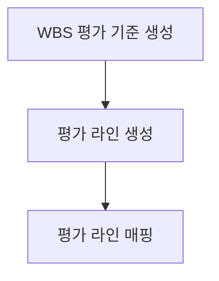
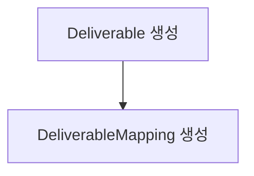
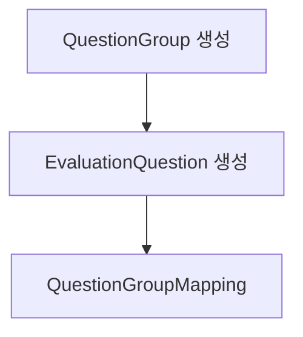
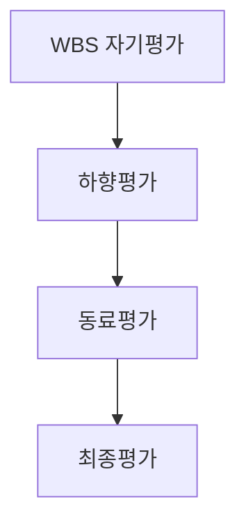
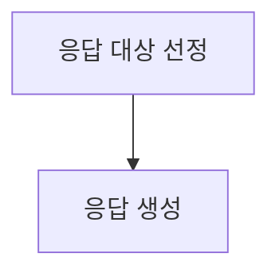

# Seed Data Generation Guide

## 개요

시드 데이터 생성 기능은 개발 및 테스트 환경에서 사용할 수 있는 현실적인 데이터를 자동으로 생성하는 기능입니다.

## 목차

1. [아키텍처](#아키텍처)
2. [시나리오](#시나리오)
3. [데이터 생성 흐름](#데이터-생성-흐름)
4. [상태 분포 설정](#상태-분포-설정)
5. [확장 가이드](#확장-가이드)

---

## 아키텍처

### 디렉토리 구조

```
src/context/seed-data-context/
├── types/                          # 타입 정의
│   ├── seed-scenario.types.ts      # 시나리오 및 설정 타입
│   ├── seed-config.types.ts        # 기본 상태 분포 설정
│   └── index.ts
├── utils/                          # 유틸리티
│   ├── probability.util.ts         # 확률 기반 선택
│   ├── score-generator.util.ts     # 점수 생성
│   ├── date-generator.util.ts      # 날짜 생성
│   └── index.ts
├── generators/                     # 단계별 생성기
│   ├── phase1-organization.generator.ts
│   ├── phase2-evaluation-period.generator.ts
│   ├── phase3-8-full-cycle.generator.ts
│   └── index.ts
├── handlers/                       # CQRS 핸들러
│   ├── commands/
│   │   ├── generate-seed-data.command.ts
│   │   └── clear-seed-data.command.ts
│   └── queries/
│       └── get-seed-data-status.query.ts
├── interfaces/
│   └── seed-data-context.interface.ts
├── seed-data.service.ts
└── seed-data-context.module.ts
```

### 레이어 구성

```
Interface Layer (API)
    ↓
Service Layer (Facade)
    ↓
Handler Layer (CQRS)
    ↓
Generator Layer (데이터 생성)
    ↓
Repository Layer (영속화)
```

---

## 시나리오

### 1. MINIMAL (최소 시나리오)

**목적**: 기본 조직 데이터만 생성

**생성 데이터**:

- Phase 1: Department, Employee, Project, WbsItem

**사용 사례**:

- 조직 구조 테스트
- 기본 CRUD 기능 테스트
- 성능 테스트 (대량 데이터)

### 2. WITH_PERIOD (평가기간 포함)

**목적**: 평가기간 설정까지 생성

**생성 데이터**:

- Phase 1: 조직 데이터
- Phase 2: EvaluationPeriod, EvaluationPeriodEmployeeMapping

**사용 사례**:

- 평가기간 관리 기능 테스트
- 직원별 평가 대상 조회 테스트

### 3. WITH_ASSIGNMENTS (할당 포함)

**목적**: 프로젝트/WBS 할당까지 생성

**생성 데이터**:

- Phase 1-2: 조직 + 평가기간
- Phase 3: EvaluationProjectAssignment, EvaluationWbsAssignment

**사용 사례**:

- 프로젝트/WBS 할당 기능 테스트
- 할당 기반 평가 준비 테스트

### 4. WITH_SETUP (평가 설정 포함) ✅

**목적**: 평가 기준 및 질문까지 생성

**생성 데이터**:

- Phase 1-3: 조직 + 평가기간 + 할당
- Phase 4: WbsEvaluationCriteria, EvaluationLine, EvaluationLineMapping
- Phase 5: Deliverable, DeliverableMapping
- Phase 6: QuestionGroup, EvaluationQuestion, QuestionGroupMapping

**사용 사례**:

- 평가 기준 설정 테스트
- 질문 관리 기능 테스트
- 평가 라인 관리 테스트

### 5. FULL (전체 사이클) ✅

**목적**: 평가 실행 및 응답까지 전체 생성

**생성 데이터**:

- Phase 1-6: 모든 설정
- Phase 7: WbsSelfEvaluation, DownwardEvaluation, PeerEvaluation, FinalEvaluation
- Phase 8: EvaluationResponse

**사용 사례**:

- 전체 평가 프로세스 E2E 테스트
- 대시보드 및 리포트 테스트
- 평가 완료 데이터 분석

---

## 데이터 생성 흐름

### Phase 1: 조직 데이터


**세부 로직**:

1. **Department 생성**
   - 최상위 부서 생성 (전체의 40%)
   - 자식 부서를 2-3단계 계층으로 생성
   - 각 부서에 코드, 순서 자동 할당

2. **Employee 생성**
   - 부서에 랜덤 할당
   - 다양한 상태 (재직중 70%, 휴직중 20%, 퇴사 10%)
   - 고유 employeeNumber (타임스탬프 기반)

3. **Project 생성**
   - 다양한 상태 (ACTIVE 60%, COMPLETED 30%, CANCELLED 10%)
   - 매니저 할당 (80% 확률)
   - 시작/종료 날짜 자동 생성

4. **WbsItem 생성**
   - 프로젝트별로 계층 구조 생성
   - Level 1-3 구조
   - 담당자 할당 (70% 확률)

### Phase 2: 평가기간


**세부 로직**:

1. **EvaluationPeriod 생성**
   - 평가기간명 자동 생성 (예: "2024년 상반기 평가")
   - 시작/종료 날짜 설정
   - 다양한 상태 분포 (PENDING, IN_PROGRESS, COMPLETED)

2. **직원 매핑**
   - 모든 활성 직원을 평가기간에 자동 매핑
   - isExcluded 상태 분포 (10%)

### Phase 3: 할당


**세부 로직**:

1. **프로젝트 할당**
   - 직원당 1-3개 프로젝트 할당
   - 첫 번째 직원을 할당자로 사용

2. **WBS 할당**
   - 직원당 2-5개 WBS 항목 할당
   - 프로젝트별로 분산

### Phase 4: 평가 기준 및 라인



**세부 로직**:

1. **WBS 평가 기준 생성**
   - WBS당 3-5개 평가 기준 생성
   - 각 기준별 가중치 자동 할당 (합계 100%)
   - 평가 항목: 업무 완성도, 품질, 일정 준수 등

2. **평가 라인 생성**
   - Primary/Secondary 라인 타입
   - 평가자 타입 (MANAGER, DIRECTOR 등)

3. **평가 라인 매핑**
   - 직원별로 1차/2차 평가자 매핑
   - 직원 계층에 따라 평가자 자동 할당

### Phase 5: 산출물



**세부 로직**:

1. **Deliverable 생성**
   - WBS당 평균 2-4개 산출물 생성
   - 다양한 타입 (DOCUMENT, CODE, REPORT 등)
   - 다양한 상태 (PENDING, IN_PROGRESS, COMPLETED)

2. **DeliverableMapping**
   - 산출물을 WBS 및 담당자에 매핑
   - 담당자는 WBS 할당자 중에서 선택

### Phase 6: 질문 그룹 및 질문



**세부 로직**:

1. **QuestionGroup 생성**
   - 기본 그룹 (역량 평가, 동료 평가 등)
   - 커스텀 그룹

2. **EvaluationQuestion 생성**
   - 그룹당 5-10개 질문
   - 다양한 질문 타입 (객관식, 주관식)
   - 일부는 점수 범위 설정

3. **QuestionGroupMapping**
   - 질문을 그룹에 매핑
   - 순서 자동 할당

### Phase 7: 평가 실행



**세부 로직**:

1. **WBS 자기평가**
   - 할당된 WBS별로 자기평가 생성
   - 다양한 진행 상태 (NOT_STARTED 30%, IN_PROGRESS 40%, COMPLETED 30%)
   - 평가 점수 및 코멘트 생성

2. **하향평가**
   - 평가 라인에 따라 1차/2차 평가 생성
   - 다양한 상태 분포
   - 평가 유형 (REGULAR, PROMOTION_REVIEW 등)

3. **동료평가**
   - 직원당 3-5명의 동료 평가자 지정
   - 상태 분포 (PENDING 40%, IN_PROGRESS 30%, COMPLETED 30%)

4. **최종평가**
   - 모든 평가를 종합한 최종 평가
   - 등급 및 직급별 등급 할당
   - 확정 상태 분포 (PENDING 40%, CONFIRMED 60%)

### Phase 8: 평가 응답



**세부 로직**:

1. **응답 대상 선정**
   - 질문의 20% 샘플링
   - 진행중/완료된 평가에만 응답 생성

2. **응답 생성**
   - 점수형/텍스트형 응답
   - 현실적인 점수 분포 (정규 분포)

---

## 상태 분포 설정

### 기본 설정 (DEFAULT_STATE_DISTRIBUTION)

```typescript
{
  // Employee 상태
  employeeStatus: {
    active: 0.7,      // 70%
    onLeave: 0.2,     // 20%
    resigned: 0.1,    // 10%
  },

  // Project 상태
  projectStatus: {
    active: 0.6,      // 60%
    completed: 0.3,   // 30%
    cancelled: 0.1,   // 10%
  },

  // WBS 상태
  wbsStatus: {
    pending: 0.3,     // 30%
    inProgress: 0.5,  // 50%
    completed: 0.2,   // 20%
  },

  // 계층 구조
  departmentHierarchy: {
    rootDepartmentRatio: 0.4,  // 최상위 40%
    maxDepth: 3,
    childrenPerParent: { min: 1, max: 3 },
  },

  wbsHierarchy: {
    maxDepth: 3,
    childrenPerParent: { min: 1, max: 4 },
  },

  // 할당 비율
  projectManagerAssignmentRatio: 0.8,  // 80%
  wbsAssignmentRatio: 0.7,             // 70%

  // Phase 4-8 상태 분포
  wbsSelfEvaluationProgress: {
    notStarted: 0.3,    // 30%
    inProgress: 0.4,    // 40%
    completed: 0.3,     // 30%
  },

  downwardEvaluationProgress: {
    notStarted: 0.3,    // 30%
    inProgress: 0.4,    // 40%
    completed: 0.3,     // 30%
  },

  downwardEvaluationType: {
    regular: 0.8,               // 80%
    promotionReview: 0.15,      // 15%
    probationReview: 0.05,      // 5%
  },

  peerEvaluationStatus: {
    pending: 0.4,       // 40%
    inProgress: 0.3,    // 30%
    completed: 0.3,     // 30%
  },

  finalEvaluationConfirmation: {
    pending: 0.4,       // 40%
    confirmed: 0.6,     // 60%
  },

  // 산출물 타입 및 상태
  deliverableType: {
    document: 0.4,      // 40%
    code: 0.3,          // 30%
    report: 0.2,        // 20%
    presentation: 0.1,  // 10%
  },

  deliverableStatus: {
    pending: 0.3,       // 30%
    inProgress: 0.4,    // 40%
    completed: 0.25,    // 25%
    rejected: 0.05,     // 5%
  },

  // 질문 그룹 설정
  questionGroupCount: 3,
  questionsPerGroup: { min: 5, max: 10 },
  questionScoreEnabled: 0.6,  // 60% 점수형 질문
}
```

### 커스텀 설정

API 요청 시 `stateDistribution` 파라미터로 커스터마이징 가능:

```json
{
  "scenario": "minimal",
  "clearExisting": true,
  "dataScale": {
    "departmentCount": 10,
    "employeeCount": 50,
    "projectCount": 5,
    "wbsPerProject": 10
  },
  "stateDistribution": {
    "employeeStatus": {
      "active": 0.9,
      "onLeave": 0.05,
      "resigned": 0.05
    }
  }
}
```

---

## 데이터 무결성

### 외래키 관계

모든 생성 데이터는 다음 무결성을 보장합니다:

1. **Employee → Department**
   - 모든 직원은 유효한 부서에 소속
   - 부서가 먼저 생성된 후 직원 할당

2. **WbsItem → Project**
   - 모든 WBS는 유효한 프로젝트에 속함
   - WBS의 parentWbsId는 동일 프로젝트 내에서만 참조

3. **EvaluationPeriodEmployeeMapping → Employee, EvaluationPeriod**
   - 존재하는 직원과 평가기간만 매핑

4. **EvaluationProjectAssignment → Employee, Project, EvaluationPeriod**
   - 모든 FK가 유효한 엔티티 참조

### 배치 저장

성능 최적화를 위해 배치 단위로 저장:

```typescript
const BATCH_SIZE = 500;

for (let i = 0; i < items.length; i += BATCH_SIZE) {
  const batch = items.slice(i, i + BATCH_SIZE);
  await repository.save(batch);
}
```

---

## 성능 최적화

### 생성 속도

| Phase                  | 데이터 수                           | 소요 시간  |
| ---------------------- | ----------------------------------- | ---------- |
| Phase 1 (조직 10개)    | Dept 10, Emp 10, Proj 3, WBS 15     | ~40ms      |
| Phase 2 (평가기간 1개) | Period 1, Mapping 10                | ~8ms       |
| Phase 3 (할당)         | ProjAssign 8, WbsAssign 35          | ~12ms      |
| Phase 4 (평가 기준)    | Criteria 45, Line 20, Mapping 10    | ~20ms      |
| Phase 5 (산출물)       | Deliverable 40, Mapping 40          | ~15ms      |
| Phase 6 (질문)         | Group 3, Question 24, Mapping 24    | ~10ms      |
| Phase 7 (평가)         | Self 35, Down 10, Peer 15, Final 10 | ~25ms      |
| Phase 8 (응답)         | Response 5                          | ~5ms       |
| **전체 (FULL)**        | **~300개 엔티티**                   | **~135ms** |

### 대용량 데이터

대용량 데이터 생성 시 권장 설정:

```json
{
  "scenario": "minimal",
  "clearExisting": true,
  "dataScale": {
    "departmentCount": 50,
    "employeeCount": 500,
    "projectCount": 100,
    "wbsPerProject": 20
  }
}
```

**예상 생성량**:

- Department: ~50개
- Employee: 500개
- Project: 100개
- WbsItem: ~2,000개
- **총 소요 시간**: ~2-3초

---

## 확장 가이드

### 새로운 Phase 추가

1. **Generator 클래스 생성**

```typescript
@Injectable()
export class Phase4CriteriaGenerator {
  async generate(
    config: SeedDataConfig,
    phase1Result: GeneratorResult,
    phase2Result: GeneratorResult,
  ): Promise<GeneratorResult> {
    // 생성 로직
  }
}
```

2. **Module에 등록**

```typescript
@Module({
  providers: [
    // ...
    Phase4CriteriaGenerator,
  ],
})
export class SeedDataContextModule {}
```

3. **Handler에서 호출**

```typescript
if (scenario >= SeedScenario.WITH_SETUP) {
  const phase4Result = await this.phase4Generator.generate(
    command.config,
    phase1Result,
    phase2Result,
  );
  results.push(phase4Result);
}
```

### 새로운 시나리오 추가

1. **Enum 추가**

```typescript
export enum SeedScenario {
  MINIMAL = 'minimal',
  // ...
  CUSTOM_SCENARIO = 'custom_scenario',
}
```

2. **Handler 로직 추가**

```typescript
case SeedScenario.CUSTOM_SCENARIO:
  // 생성 로직
  break;
```

### 새로운 상태 분포 추가

1. **타입 정의**

```typescript
export interface StateDistributionConfig {
  // 기존...
  newEntityStatus?: {
    status1: number;
    status2: number;
  };
}
```

2. **기본값 설정**

```typescript
export const DEFAULT_STATE_DISTRIBUTION = {
  // 기존...
  newEntityStatus: {
    status1: 0.6,
    status2: 0.4,
  },
};
```

---

## 테스트

### E2E 테스트

```typescript
it('MINIMAL 시나리오 데이터 생성', async () => {
  const response = await request(app)
    .post('/admin/seed/generate')
    .send({
      scenario: 'minimal',
      clearExisting: true,
      dataScale: {
        departmentCount: 5,
        employeeCount: 10,
        projectCount: 3,
        wbsPerProject: 5,
      },
    })
    .expect(201);

  expect(response.body.success).toBe(true);
});
```

### 데이터 품질 검증

```typescript
it('Employee가 Department에 올바르게 할당되어야 함', async () => {
  // 시드 데이터 생성
  await generateSeedData();

  // 검증
  const employees = await employeeRepository.find();
  const departments = await departmentRepository.find();

  employees.forEach((emp) => {
    const dept = departments.find((d) => d.id === emp.departmentId);
    expect(dept).toBeDefined();
  });
});
```

---

## 문제 해결

### 중복 키 에러

**문제**: Employee의 employeeNumber 중복

**해결**: 타임스탬프 기반 고유 번호 생성

```typescript
const timestamp = Date.now().toString().slice(-6);
emp.employeeNumber = `EMP${timestamp}${String(i + 1).padStart(3, '0')}`;
```

### FK 제약 조건 위반

**문제**: 참조하는 엔티티가 존재하지 않음

**해결**: 생성 순서 준수

1. 부모 엔티티 먼저 생성 및 저장
2. 저장된 ID 사용하여 자식 엔티티 생성

### 메모리 부족

**문제**: 대량 데이터 생성 시 메모리 초과

**해결**: 배치 처리

```typescript
const BATCH_SIZE = 500;
for (let i = 0; i < items.length; i += BATCH_SIZE) {
  const batch = items.slice(i, i + BATCH_SIZE);
  await repository.save(batch);
}
```

---

## 참고 자료

- [API 사용 가이드](../../../../public/api-docs/admin-seed-data.md)
- [도메인 분류 가이드](../../../domain-classification-guide.md)
- [데이터베이스 테이블 명세](../../../database-tables-specification.md)
